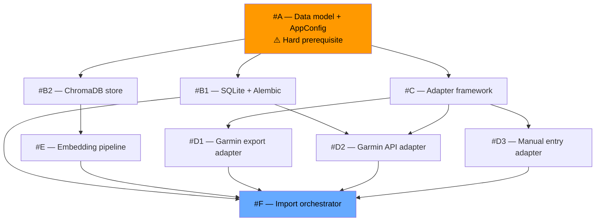

<!-- docs\planning\issue1\planning.md -->
<!-- template=planning version=130ac5ea created=2026-03-06T22:10Z updated= -->
# Epic 1: Data Fundament — Planning

**Status:** DRAFT  
**Version:** 1.1  
**Last Updated:** 2026-03-06

---

## Purpose

Decompose Epic 1 into concrete child issues, map their interdependencies, and establish the implementation sequence. This document is the direct output of the research bridge (docs/planning/issue1/research.md — Bridge to Planning Phase).

## Scope

**In Scope:**
Child issue definitions, dependency relationships, implementation sequence, milestone checkpoints.

**Out of Scope:**
Design decisions (class diagrams, interface contracts, sequence diagrams — design phase). Implementation (TDD cycles — tdd/integration phases). Scope changes to the Epic 1 findings.

## Prerequisites

Read these first:
1. docs/planning/issue1/research.md complete and findings accepted
2. Epic 1 branch epic/1-data-fundament active
3. Coding standards read: docs/coding_standards/README.md
---

## Summary

Nine child issues derived from the six architectural groupings identified in research (A–F). Issues within the same grouping can be developed in parallel once their prerequisites are met. The single hard prerequisite is #A (data model + AppConfig), which must be complete before any other issue starts.

---

## Dependencies



**Textual summary:**
- `#A` blocks everything — no other issue may start before it is merged
- After `#A`: `{#B1, #B2, #C}` can start simultaneously
- After `#C` and `#A`: `#D1` and `#D3` can start simultaneously; `#D2` additionally requires `#B1`
- `#E` requires only `#B2` — it is independent of the concrete adapters (see note below)
- `#F` requires `#B1 + #E + #D1` as the minimum for a first working end-to-end run; `#D2` and `#D3` can be added afterward without changing the orchestrator
- `#D2` requires `#B1` in addition to `#A` and `#C`: the sync-state checkpoint (resumable imports, research Finding 7) writes to the `sync_state` table owned by `#B1`

> **Note — #E vs concrete adapters:** The research bridge (Grouping E) described a runtime dependency
> on Group D: you need actual records before you can embed them in production. Planning deliberately
> relaxes this to a *development* independence: `EmbeddingPipeline` depends on `ActivityRecord` DTOs,
> not on any adapter. All TDD cycles for `#E` are fully executable using `ActivityRecord` fixture
> instances — no working adapter required. The runtime dependency (records must exist in SQLite before
> the pipeline is triggered end-to-end) is handled by `#F`, not by `#E` itself.

---

## Child Issues

| Issue | Title | `issue_type` | `priority` | `scope` | Depends on | Parallel with |
|---|---|---|---|---|---|---|
| **#A** | Data model + AppConfig | `feature` | `high` | `data` | — | — |
| **#B1** | SQLite + Alembic storage | `feature` | `high` | `data` | #A | #B2, #C |
| **#B2** | ChromaDB vector store | `feature` | `high` | `data` | #A | #B1, #C |
| **#C** | Adapter framework | `feature` | `high` | `backend` | #A | #B1, #B2 |
| **#D1** | Garmin export adapter | `feature` | `high` | `data` | #A, #C | #D2, #D3 |
| **#D2** | Garmin Connect API adapter | `feature` | `medium` | `data` | #A, #C, #B1 | #D1, #D3 |
| **#D3** | Manual entry adapter | `feature` | `medium` | `data` | #A, #C | #D1, #D2 |
| **#E** | Embedding pipeline | `feature` | `high` | `ai` | #A, #B2 | #D1, #D2, #D3 |
| **#F** | Import orchestrator | `feature` | `high` | `backend` | #B1, #E, #D1 | — |

### Issue Descriptions

**#A — Data model + AppConfig**
`ActivityRecord` DTO (all fields from research Finding 8), `WellnessRecord`, `SyncState` supporting
models. Typed `AppConfig` with Pydantic loading of `storage.yaml`, `ai.yaml`, `sync.yaml`. Fail-fast
startup validation of all paths. No IO logic — pure schema and config.
```
create_issue(issue_type="feature", title="Data model + AppConfig", priority="high", scope="data",
  parent_issue=1,
  body={
    "problem": "No internal data model or config structure exists. Every subsequent issue depends on ActivityRecord, WellnessRecord, SyncState DTOs and a typed AppConfig being locked first.",
    "expected": "ActivityRecord (all Finding 8 fields), WellnessRecord, SyncState Pydantic DTOs. Typed AppConfig loading storage.yaml, ai.yaml, sync.yaml. Fail-fast startup validation. No IO.",
    "context": "Hard prerequisite for all other Epic 1 issues. Schema changes after this is merged cascade to all adapters and repositories."
  })
```

**#B1 — SQLite + Alembic storage**
`IActivityReader`, `IActivityWriter`, `ISyncStateStore` interface definitions. `SQLiteRepository`
implementation. Initial Alembic migration with `activity_records` and `sync_state` tables.
```
create_issue(issue_type="feature", title="SQLite + Alembic storage layer", priority="high", scope="data",
  parent_issue=1,
  body={
    "problem": "No relational persistence layer exists for ActivityRecord and SyncState.",
    "expected": "IActivityReader, IActivityWriter, ISyncStateStore interfaces. SQLiteRepository implementation. Initial Alembic migration for activity_records and sync_state tables. All writes are upserts.",
    "context": "Depends on #A (data model). Required by #F (orchestrator) and #D2 (API adapter, which uses ISyncStateStore for checkpointing)."
  })
```

**#B2 — ChromaDB vector store**
`IEmbeddingStore` interface. `ChromaDBStore` implementation. Collection initialisation must write
embedding model name, version, and dimensions to collection metadata at creation time (hard
constraint from research Finding 5b).
```
create_issue(issue_type="feature", title="ChromaDB embedded vector store", priority="high", scope="data",
  parent_issue=1,
  body={
    "problem": "No vector store exists for semantic retrieval of activity embeddings.",
    "expected": "IEmbeddingStore interface. ChromaDBStore implementation. Collection init writes embedding model name, version, and dimensions to collection metadata at creation (non-negotiable constraint from Finding 5b).",
    "context": "Depends on #A. Required by #E (embedding pipeline). Embedding model metadata must be present from first collection creation — cannot be retrofitted."
  })
```

**#C — Adapter framework**
`BaseAdapter` abstract class with `ingest() -> list[ActivityRecord]` signature. `AdapterRegistry`
(source registry pattern). No concrete IO — interface and registration mechanism only.
```
create_issue(issue_type="feature", title="Adapter framework (BaseAdapter + registry)", priority="high", scope="backend",
  parent_issue=1,
  body={
    "problem": "No pluggable adapter abstraction exists. Without it, concrete adapters cannot be added without modifying the import pipeline (violates OCP).",
    "expected": "BaseAdapter abstract class with ingest() -> list[ActivityRecord]. AdapterRegistry (source registry pattern). No IO logic — interfaces only.",
    "context": "Depends on #A. Required by #D1, #D2, #D3. Adding a future adapter (e.g. Strava) must require zero changes to the orchestrator."
  })
```

**#D1 — Garmin export adapter**
ZIP extraction, FIT `session` message parsing via `fitparse`, UTC normalisation. `source =
"garmin_export"`, `record_type = "historical"`, `confidence = 1.0`. Only `session` messages
— `record`/`hrv` parsing is explicitly out of scope (deferred to Epic 4).
```
create_issue(issue_type="feature", title="Garmin export adapter (ZIP + FIT)", priority="high", scope="data",
  parent_issue=1,
  body={
    "problem": "Bulk historical Garmin data is locked in export ZIP files containing FIT binaries. No parser exists.",
    "expected": "GarminExportAdapter: extracts ZIP, parses FIT session messages via fitparse, normalises to UTC, produces ActivityRecord list with source=garmin_export, record_type=historical, confidence=1.0. session messages only — record/hrv out of scope.",
    "context": "Depends on #A and #C. Highest-priority adapter: provides bulk history with no credentials. Minimum required for Milestone 2 (first end-to-end import)."
  })
```

**#D2 — Garmin Connect API adapter**
`garth` OAuth2 session, activity listing, field mapping (research Finding 1). Exponential backoff
+ jitter for 429 responses; sync-state checkpoint (last synced ID) for resumable imports writes
to `sync_state` table via `ISyncStateStore` (research Finding 7). Requires `#B1` because
`ISyncStateStore` is implemented there.
```
create_issue(issue_type="feature", title="Garmin Connect API adapter", priority="medium", scope="data",
  parent_issue=1,
  body={
    "problem": "No ongoing sync from Garmin Connect API exists. Without it, data stays stale after the initial historical import.",
    "expected": "GarminApiAdapter: garth OAuth2, activity listing, field mapping per Finding 1, exponential backoff for 429s, sync-state checkpointing (last synced activity ID) via ISyncStateStore for resumable imports.",
    "context": "Depends on #A, #C, and #B1 (ISyncStateStore is in SQLiteRepository). API is unofficial — isolate fully behind BaseAdapter."
  })
```

**#D3 — Manual entry adapter**
Input normalisation, system UUID as `external_id`, `record_type` branching (`historical` vs
`planned`), `scenario_id` support, `confidence` passthrough from input.
```
create_issue(issue_type="feature", title="Manual entry adapter", priority="medium", scope="data",
  parent_issue=1,
  body={
    "problem": "No mechanism exists for users to fill historical gaps or create planned/scenario records.",
    "expected": "ManualEntryAdapter: normalises form input, assigns system UUID as external_id, branches on record_type (historical vs planned), supports scenario_id, passes confidence from input.",
    "context": "Depends on #A and #C. Dual-role: historical gap-filling and planned/scenario records. The schema fields for this (record_type, scenario_id, confidence) are already designed in #A."
  })
```

**#E — Embedding pipeline**
`ActivityRecord` → text serialisation → `all-MiniLM-L6-v2` local inference via
`sentence-transformers`. Embedding model read from `AppConfig` (never hardcoded). Writes vectors
to ChromaDB via `IEmbeddingStore`. Per-activity only — per-week rollup deferred.
```
create_issue(issue_type="feature", title="Embedding pipeline (per-activity)", priority="high", scope="ai",
  parent_issue=1,
  body={
    "problem": "No mechanism exists to vectorise ActivityRecord instances for semantic retrieval in Epic 2.",
    "expected": "EmbeddingPipeline: serialises ActivityRecord to text, runs all-MiniLM-L6-v2 inference via sentence-transformers (model from AppConfig), writes to ChromaDB via IEmbeddingStore. Per-activity granularity only.",
    "context": "Depends on #A and #B2. Embedding model is config-driven — must never be hardcoded. Model choice here is an explicit contract with Epic 2 (Finding 5c)."
  })
```

**#F — Import orchestrator**
Accepts a `BaseAdapter`, calls `ingest()`, applies dedup hash (research Finding 6), upserts via
`IActivityWriter`, triggers embedding via `IEmbeddingStore`, updates sync state via
`ISyncStateStore`. All dependencies injected (DIP). First working end-to-end run requires `#D1`
as the minimum adapter.
```
create_issue(issue_type="feature", title="Import orchestrator + deduplication", priority="high", scope="backend",
  parent_issue=1,
  body={
    "problem": "No top-level pipeline exists to coordinate ingestion, persistence, embedding, and deduplication across all adapters.",
    "expected": "ImportOrchestrator: dispatches to BaseAdapter, applies sha256 dedup hash per Finding 6, upserts via IActivityWriter, triggers EmbeddingPipeline, updates ISyncStateStore. All deps injected. Idempotent by design.",
    "context": "Depends on #B1, #E, and minimum #D1. Additional adapters (#D2, #D3) plug in without changing this class (OCP). Pipeline end-to-end test is Milestone 2."
  })
```


---

## Risks & Mitigation

- **Risk:** ChromaDB collection created without embedding model metadata
  - **Mitigation:** #B2 must enforce metadata write in `collection.create()` — covered by a dedicated test that asserts metadata presence on new collections.
- **Risk:** AppConfig shape changes after #B1/#B2/#C have started in parallel, requiring coordinated updates
  - **Mitigation:** #A must fully stabilise config YAML structure before any parallel issue is started. The config schema is locked when #A is merged.
- **Risk:** Garmin Connect API changes without notice, breaking #D2
  - **Mitigation:** #D2 is fully isolated behind `BaseAdapter` — impact is contained to one file and one adapter.
- **Risk:** FIT file format variation across older Garmin devices produces unexpected session fields
  - **Mitigation:** All non-core `ActivityRecord` fields are nullable (research Finding 8). The parser treats unknown fields as no-ops.
- **Risk:** Scope creep from per-second `record` and `hrv` FIT messages
  - **Mitigation:** #D1 parses `session` messages only. `record`/`hrv` parsing is explicitly out of scope for Epic 1 and blocked at issue level.

---

## Milestones

- Milestone 1 — Schema locked: #A merged. All subsequent issues may start.
- Milestone 2 — First end-to-end import: #A + #B1 + #B2 + #C + #D1 + #E + #F merged. A Garmin export ZIP can be imported, stored in SQLite, and embedded in ChromaDB.
- Milestone 3 — All sources connected: #D2 + #D3 merged. All three ingestion paths operational.
- Milestone 4 — Epic 1 complete: all nine issues merged, full test coverage, quality gates passing. Epic 2 (AI Layer) implementation may start. Note: Epic 2 research and planning can begin earlier — as soon as the embedding model contract (research Finding 5c) is accepted as an input constraint by Epic 2. Epic 2 does not need to wait for Epic 1 to be fully merged.

## Related Documentation
- **[docs/planning/issue1/research.md][related-1]**
- **[docs/coding_standards/README.md][related-2]**
- **[docs/coding_standards/CODE_STYLE.md][related-3]**

<!-- Link definitions -->

[related-1]: docs/planning/issue1/research.md
[related-2]: docs/coding_standards/README.md
[related-3]: docs/coding_standards/CODE_STYLE.md

---

## Version History

| Version | Date | Author | Changes |
|---------|------|--------|---------|
| 1.0 | 2026-03-06 | Agent | Initial draft |
| 1.1 | 2026-03-06 | Agent | Fixed D2 textual summary (was internally inconsistent with graph); added note on #E development independence from concrete adapters; added issue_type/priority columns to child issue table; added create_issue blocks per issue; nuanced Milestone 4 re Epic 2 sequencing |